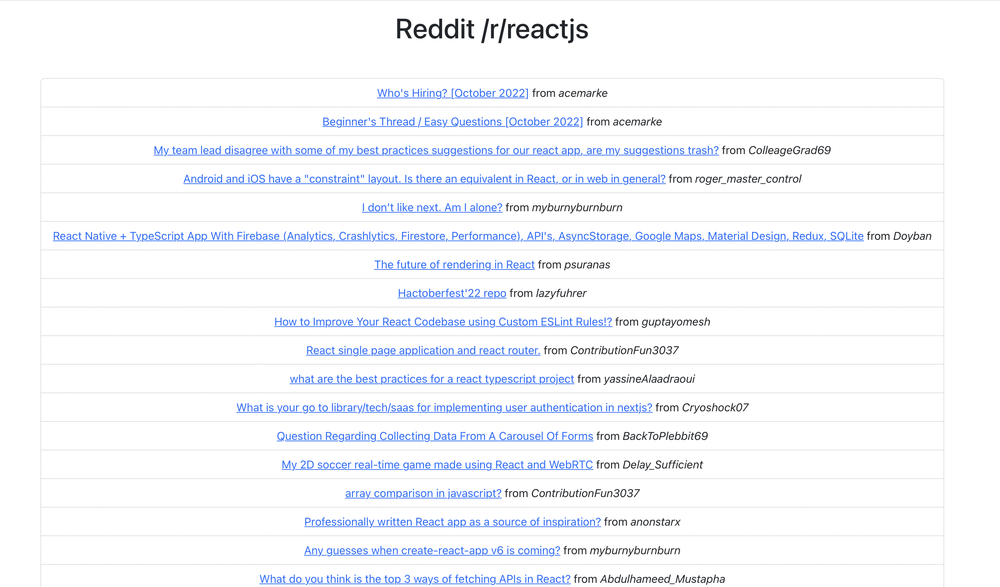

# Reddit Posts

This is the source code of my online ReactJS courses, available on my 👉 [YouTube channel](https://www.youtube.com/channel/UCGqLuT0upPiocwYSnnmqt2g) 😺

**This Reddit React app uses:**
* [Axios](https://github.com/axios/axios)
* [React Bootstrap](https://github.com/react-bootstrap/react-bootstrap)
* [React Loader Spinner](https://github.com/mhnpd/react-loader-spinner)

## 🖼 Screenshot

## ⚙️ Setting Up

1. Make sure you have npm v6 or newer installed (by installing [NodeJS](https://nodejs.org/en/download)).
2. Run `npm ci` to install all dependencies.
3. `npm start` to start your React client application.

## 🧑‍🎨 Author

I'm [Pierre-Henry Soria](https://ph7.me), a SUPER passionate software engineer 🤖

I love reading information books and learning new things daily! 😊

I'm also the founder of [pH7's Social Dating Builder 🚀](https://github.com/pH7Software/pH7-Social-Dating-CMS) and hundreds of other open source projects such as [Lifyzer, Healthy Food 🍍](https://github.com/Lifyzer) and [others](https://github.com/pH-7?tab=repositories).

 

## ⚖️ License

Distributed under [MIT](https://opensource.org/licenses/MIT) license 🎉
